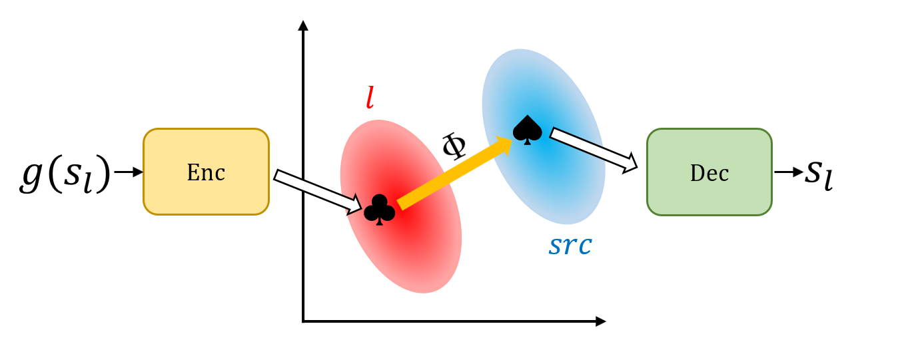

# Cross-lingual Back-Parsing: Utterance Synthesis from Meaning Representation for Zero-Resource Semantic Parsing

This repository contains the official implementation of the paper "Cross-lingual Back-Parsing: Utterance Synthesis from Meaning Representation for Zero-Resource Semantic Parsing," accepted at EMNLP 2024.

Currently, the code is being organized and will be released soon, no later than by 11/11/2024.
So, please stay tuned!