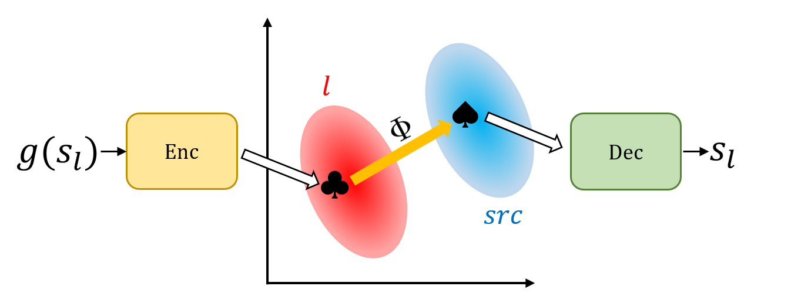

## Cross-lingual Back-Parsing: Utterance Synthesis from Meaning Representation for Zero-Resource Semantic Parsing


This repository contains the official implementation of the paper "Cross-lingual Back-Parsing: Utterance Synthesis from Meaning Representation for Zero-Resource Semantic Parsing" accepted at EMNLP 2024.


## Requirements
```
conda create -n cbp python=3.10
conda install pytorch torchvision torchaudio pytorch-cuda=12.1 -c pytorch -c nvidia
pip install -r requirements.txt

```
## Datasets
```
mkdir data
mkdir data/mschema2qa
```
Download train.json and test.json of mschema2qa dataset from [XSemPLR repository](https://github.com/psunlpgroup/XSemPLR) and move them to the mschema2qa directory.

## 02/21 Updated
We uploaded filtered generated predictions synthesized from CBP model for Mschema2QA dataset. 
Please check [here](https://huggingface.co/deokhk/language-adapters/tree/main/filtered_generated_predictions).


## Training Utterance generator
Training utterance generator consists of two steps: training a language adapter and training a utterance generator using the trained language adapter. 
### Training language adapters
First, we train a language adapter using source-switched denoising training. Make sure that you are at the root directory of the repository.
#### Extracting language mean vectors
To train language adapters using source-switched denoising training, we first extract language mean vector for each langauge. 

```bash
#!/bin/bash

langs=("en" "zh" "vi" "tr" "pl" "it" "fi" "fa" "ar" "pt" "ja" "es" "de")

for lang in ${langs[@]}; do
    CUDA_VISIBLE_DEVICES=0 python language_identity.py \
    --dataset_name deokhk/${lang}_wiki_sentences_1000000 \
    --per_device_eval_batch_size 64 \
    --output_dir language_identity/${lang}_wiki_token_1000000 \
    --max_token_count 1000000 \
    --model_name google/mt5-large
done
```
By executing the above bash script, you can extract language mean vectors for each language. The extracted mean vectors will be saved in `language_identity` directory.

#### Training language adapters
We recommend downloading the pre-trained adapters from [here](https://huggingface.co/deokhk/language-adapters), as training language adapters from scratch is computationally expensive.
However, if you want to train language adapters from scratch, you can run the script at ./scripts/language_adapter_training/*. Training a adapter for single language took 26hours on four A100-80GB GPUs. Make sure to move the script to the root directory of the repository before running the script.

Running the script will save trained model to './output/OneM-en{lang}_{lang}../best_checkpoint'.
Let's denote the above path as `adapter_model_dir`. 
* Among the pre-trained adapters you can download above, the English adapter is "OneM-enen-en-mean_eng-32.1e-4.1000".  

#### Extracting language adapters only
To extract language adapters only, run the following script for each language.
```bash
#!/bin/bash
lang="zh" # language used for adapter training. e.g ) en, zh..
ADAPTER_NAME=OneM-en${lang}_${lang}-mean_eng
python extract_adapter_ckpt.py --checkpoint_dir adapter_model_dir \
--lang ${lang} \
--output_adapter_file_name ${ADAPTER_NAME}

```
Change the `lang` to the language you used for training the adapter. The extracted adapter will be saved as a safetensor file in the `adapter_model_dir` directory. Make sure to check the existence of 'config.json' file and 'ADAPTER_NAME' file in the adapter_model_dir after running the script.

### Utterance generation training
Train the utterance generator with utterance generation objective, with English language adapter equipped. (source language)
```bash
#!/bin/bash
EPOCHS=50
BATCH_SIZE=16
GPU_NUM=4
GRAD_ACCUM_STEP=4
LR=3e-5
WARMUP=500

BATCH_SIZE_PER_GPU=$(($BATCH_SIZE/($GPU_NUM*$GRAD_ACCUM_STEP)))
VALID_BATCH_SIZE_PER_GPU=$(($BATCH_SIZE_PER_GPU*2))

OUTPUT=output
TAG=mschema2qa-mr2text-enko-${EPOCHS}.${BATCH_SIZE}.${LR}.${WARMUP}
ADAPTER_DIR=./output/OneM-enen-en-100000-mean_eng-4.1e-4.1000 # Your path to english adapter

torchrun --nproc_per_node=4 --nnodes 1 --rdzv_backend c10d --master_port 0 run.py --do_task_finetune \
              --epochs $EPOCHS \
              --batch_size $BATCH_SIZE_PER_GPU \
              --valid_batch_size $VALID_BATCH_SIZE_PER_GPU  \
              --gradient_accumulation_steps $GRAD_ACCUM_STEP \
              --learning_rate $LR \
              --warmup_steps $WARMUP \
              --output $OUTPUT \
              --exp_tag $TAG \
              --langs en,en \
              --task_lang en \
              --pretrained_adapter_dir ${ADAPTER_DIR} \
              --train_file "./data/mschema2qa/train.json" \
              --valid_file "./data/mschema2qa/test.json" \
              --dataset_type mschema2qa \
              --freeze_option decoder_only
```
We used the last checkpoint of the utterance generator for the utterance synthesis. This is because the last checkpoint showed the best performance in our experiments.

### Utterance synthesis
Syntheize utterances in target languages from source meaning representations using the trained utterance generator. 
```bash
#!/bin/bash

MODEL_PATH=./output/mschema2qa-mr2text-1K-50.16.3e-5.500/last_checkpoint/
INFERENCE_FILE=./data/mschema2qa/train.json

langs=("zh" "tr" "pl" "it" "fi" "fa" "ar" "ja" "es" "de")
for lang in ${langs[@]}; do
    PRETRAINED_ADAPTER_DIR=./output/OneM-en${lang}-${lang}-1000-mean_eng-32.1e-4.300/
    CUDA_VISIBLE_DEVICES=0 python run.py --do_synthesize \
              --valid_batch_size 32  \
              --model_name_or_path $MODEL_PATH \
              --langs en,${lang} \
              --task_lang ${lang} \
              --adapter_types "decoder-lang" \
              --pretrained_adapter_dir $PRETRAINED_ADAPTER_DIR \
              --inference_data_file $INFERENCE_FILE \
              --generation_num_beams 4 \
              --repetition_penalty 1.2 \
              --dataset_type mschema2qa \
              --dataset_lang en
done
```

This will save the synthesized utterances under the `MODEL_PATH` directory. 
## Filtering generated utterances
To perform filtering, we first need to train the vanilla semantic parsing model, using the english labeled data.

### Training vanilla semantic parsing model
You can train the vanilla semantic parsing model using the  script at ./scripts/zero_shot_semantic_parser_training/*. Make sure to move the script to the root directory of the repository before running the script. This script will save the trained model to specified save_path. Before running the script, make sure that you have a large enough disk space, as we save every checkpoint during training. 

Note: You can run bash script by running
```bash
bash example_script.sh
```

### Evaluating the trained model
You can evaluate the trained model by running the following script. 

```bash
CUDA_VISIBLE_DEVICES=0 python evaluate_mschema2qa_text2sql_ckpts.py --batch_size 8 \
--device 0 \
--seed 42 \
--save_path ./models/mt5-mschema2qa-seed32 \
--model_name_or_path google/mt5-large \
--eval_results_path ./eval_results/mschema2qa_base_32 \
--mode eval \
--dev_filepath ./data/mschema2qa/test.json \
--dataset_lang en \
--cross_dataset_lang ja \
--num_beams 8 \
--num_return_sequences 1 \
--wandb_log \
--exp_name eval_mschema2qa_base_32
```
Make sure to set 'save_path' as a directory where the every checkpoint of the vanilla semantic parsing model is saved. The evaluation results will be saved in the 'eval_results_path' directory, and the best checkpoint is selected based on the english test set performance. If you want to evaluate on xspider, please refer to the ./scripts/semantic_parser_evaluation/eval_xspider_checkpoints.sh script and .md file.

### Filtering
You can filter the generated utterances by running the script at ./scripts/filtering/*. Make sure to move the script to the root directory of the repository before running the script. The script will save the filtered utterances at the same directory where the generated utterances are saved, with the prefix 'filtered_'.

Now that we have a filtered set of utterances, we can train the semantic parser using the filtered utterances along with the english labeled data.


## Training semantic parser using filtered utterances

You can train the semantic parser with the filtered utterances by running the script at ./scripts/cbp_final_training/*. Please put filtered utterances as a corresponding argument to "--multi_pt_dataset_path_list" in the script.

Make sure that you have a large enough disk space, as we save every checkpoint during training. The script will save the trained model to the specified save_path.

## Evaluation

First, evaluate the trained checkpoints on the English test set. (./scripts/semantic_parser_evaluation/eval_mschema2qa_checkpoints.sh)
Then, evaluate the best checkpoint on the target language test set. (./scripts/semantic_parser_evaluation/eval_mschema2qa.sh)

Please refer to the ./scripts/semantic_parser_evaluation/*. for more details on evaluation.


## Citation

If you find this repository helpful, please cite the following paper:

```
@inproceedings{kang-etal-2024-cross,
    title = "Cross-lingual Back-Parsing: Utterance Synthesis from Meaning Representation for Zero-Resource Semantic Parsing",
    author = "Kang, Deokhyung  and
      Hwang, Seonjeong  and
      Kim, Yunsu  and
      Lee, Gary",
    editor = "Al-Onaizan, Yaser  and
      Bansal, Mohit  and
      Chen, Yun-Nung",
    booktitle = "Proceedings of the 2024 Conference on Empirical Methods in Natural Language Processing",
    month = nov,
    year = "2024",
    address = "Miami, Florida, USA",
    publisher = "Association for Computational Linguistics",
    url = "https://aclanthology.org/2024.emnlp-main.792",
    doi = "10.18653/v1/2024.emnlp-main.792",
    pages = "14303--14317",
    abstract = "Recent efforts have aimed to utilize multilingual pretrained language models (mPLMs) to extend semantic parsing (SP) across multiple languages without requiring extensive annotations. However, achieving zero-shot cross-lingual transfer for SP remains challenging, leading to a performance gap between source and target languages. In this study, we propose Cross-Lingual Back-Parsing (CBP), a novel data augmentation methodology designed to enhance cross-lingual transfer for SP. Leveraging the representation geometry of the mPLMs, CBP synthesizes target language utterances from source meaning representations. Our methodology effectively performs cross-lingual data augmentation in challenging zero-resource settings, by utilizing only labeled data in the source language and monolingual corpora. Extensive experiments on two cross-language SP benchmarks (Mschema2QA and Xspider) demonstrate that CBP brings substantial gains in the target language. Further analysis of the synthesized utterances shows that our method successfully generates target language utterances with high slot value alignment rates while preserving semantic integrity. Our codes and data are publicly available at https://github.com/deokhk/CBP.",
}
```

## Acknowledgement
This codebase is built upon the codebase from [RESDSQL](https://github.com/RUCKBReasoning/RESDSQL).
We thank the authors for open-sourcing them.
